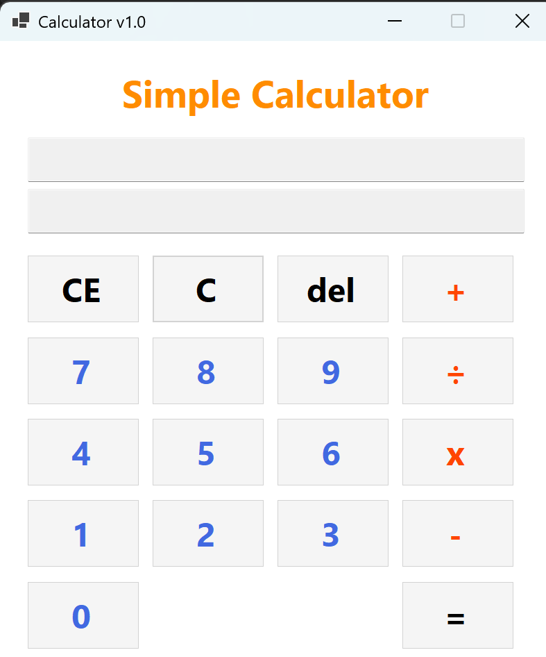
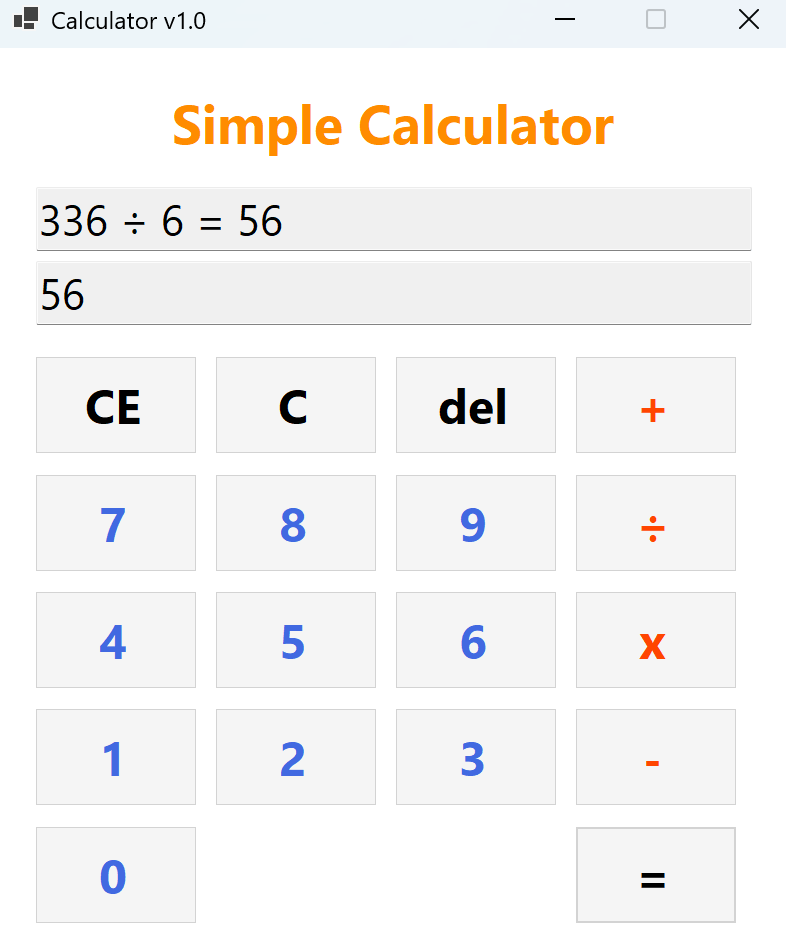

# (C# 코딩) 심플 사칙연산기

## 개요
- C# 프로그래밍 학습
- 1줄 소개: 숫자 버튼과 키보드 입력을 통해 사칙연산(+, -, ×, ÷)을 수행하고 결과를 표시하는 심플 계산기 프로그램
- 사용한 플랫폼:
    - C#, .NET Windows Forms, Visual Studio, GitHub
- 사용한 컨트롤:
    - Label, TextBox, Button
- 사용한 기술과 구현한 기능:
    - Visual Studio를 이용하여 계산기 UI를 디자인하고 버튼을 배치하였다.
    - int.Parse()를 이용하여 문자열에서 정수로의 형 변환을 처리하였다.
    - ToString()을 이용하여 계산 결과값을 문자열로 변환하고 화면에 출력하였다.
    - KeyPress 및 KeyDown 이벤트를 이용하여 키보드 입력을 처리하였다.
    - switch 문을 이용하여 사칙연산을 분기 처리하였으며, 0으로 나누기 예외처리와 선행 0 입력 방지 기능을 구현하였다.

## 실행 화면 (과제1)
- 과제1 코드의 실행 스크린샷

- 과제 내용
    - 숫자 버튼(0~9), 더하기(+), 등호(=) 버튼과 TextBox 2개, 타이틀 Label을 배치하여 기본 UI를 구성하였다. 위쪽 TextBox(txtExpression)에는 입력 내용 전체가 누적되어 표시되고, 아래쪽 TextBox(txtResult)에는 등호(=) 버튼을 눌렀을 때 계산 결과값만 표시되도록 하였다.
- 구현 내용과 기능 설명
    - 숫자 버튼을 클릭하면 txtExpression에 숫자가 누적되어 표시되었다. 더하기(+) 버튼을 누르면 현재까지 입력된 숫자를 firstNumber 변수에 저장하고 연산자를 함께 표시하였다. 등호(=) 버튼을 누르면 두 번째 숫자를 int.Parse()로 변환한 뒤 덧셈을 수행하고 결과를 txtResult에 표시하였다.

## 실행 화면 (과제2)
- 과제2 코드의 실행 스크린샷

- 과제 내용
    - 과제1의 더하기 기능에 더해 빼기(-), 곱하기(x), 나누기(÷) 버튼을 추가하여 사칙연산을 완성하였다. 각 연산자 버튼은 하나의 공통 이벤트 핸들러(BtnOperator_Click)에 연결하였으며, 클릭된 버튼의 텍스트를 currentOperator 변수에 저장하여 연산자를 구분하였다.
- 구현 내용과 기능 설명
    - 연산자 버튼 클릭 시 currentOperator에 연산자를 저장하고 firstNumber를 기록하였다. 등호(=) 버튼 클릭 시 switch 문으로 currentOperator를 분기하여 해당 사칙연산을 수행하였다. 결과값은 ToString()으로 변환되어 txtResult에 표시되었으며, txtExpression에는 전체 식이 표시되었다.

## 실행 화면 (과제3)
- 과제3 코드의 실행 스크린샷

- 과제 내용
    - 첫번째 사진(수식 입력), 두번째 사진(del 기능 구현), 세번째 사진(CE 기능 구현), 네번째 사진(C 기능 구현) 
    - 계산기의 수정 및 삭제 기능을 담당하는 C, CE, Del 버튼을 추가로 구현하였다. C 버튼은 모든 입력과 변수를 초기화하고, CE 버튼은 마지막으로 입력한 피연산자만 삭제하며, Del 버튼은 마지막으로 입력된 숫자 한 글자를 삭제하도록 하였다.
- 구현 내용과 기능 설명
    - C 버튼 클릭 시 txtExpression과 txtResult를 비우고 firstNumber, currentOperator 등 모든 변수를 초기 상태로 리셋하였다. CE 버튼 클릭 시 연산자 입력 전이면 전체를 지우고, 연산자 입력 후이면 두 번째 피연산자만 삭제하여 연산자까지의 식으로 되돌렸다. Del 버튼은 Substring()을 이용해 마지막 글자 하나를 제거하였다.

## 실행 화면 (과제4)
- 과제4 코드의 실행 스크린샷

- 과제 내용
    - 첫번째 사진과 두번째 사진 : 연산을 연속으로 할 수 있는 기능 구현 인증.
    - 사용자 편의를 위한 추가 기능을 구현하였다. 키보드 숫자 및 연산자 입력 지원, 0으로 나누기 예외처리, 연속 계산 기능(등호 없이 연산자를 연속으로 눌러도 자동 계산 후 이어서 계산), TextBox 커서 자동 스크롤, 선행 0 입력 방지 기능을 추가하였다.
- 구현 내용과 기능 설명
    - KeyPress 이벤트로 숫자(0~9)와 연산자(+, -, *, /) 키보드 입력을 처리하였으며, *는 곱하기(x), /는 나누기(÷)로 매핑하였다. 나누기 연산 시 두 번째 숫자가 0이면 "0으로 나눌 수 없습니다" 메시지를 표시하고 초기화하였다. 연속 계산은 isResult 플래그로 구현하여 결과값을 다음 계산의 첫 번째 피연산자로 자동 사용하였다. ScrollToEnd()로 텍스트 입력 시 커서가 항상 끝을 따라가도록 하였다. 또한 입력 중인 숫자의 마지막 연속 자릿수가 "0"인 경우 추가 숫자 입력을 차단하여 "0025"와 같은 선행 0이 포함된 수가 입력되지 않도록 하였다.
