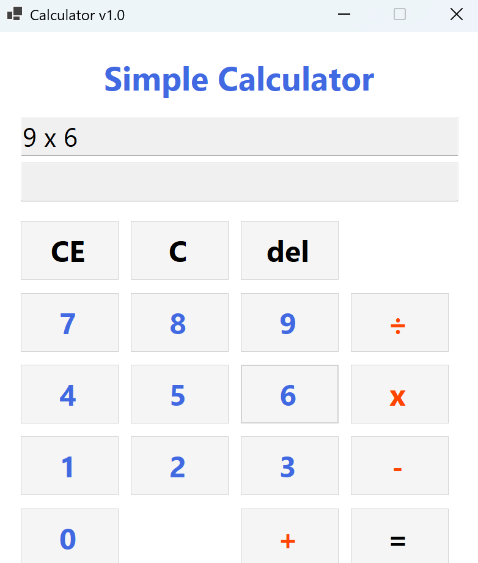
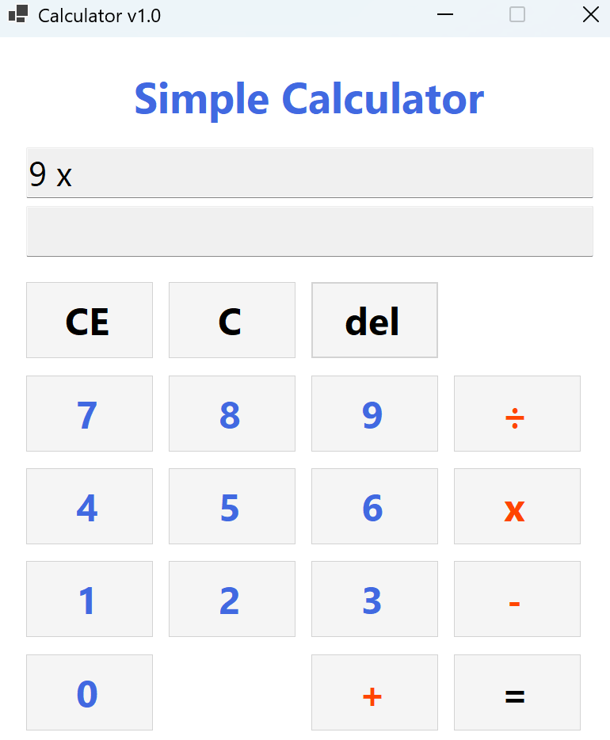
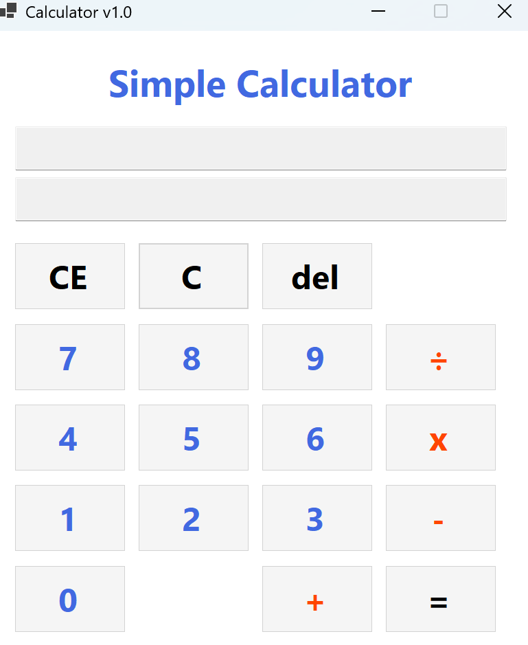
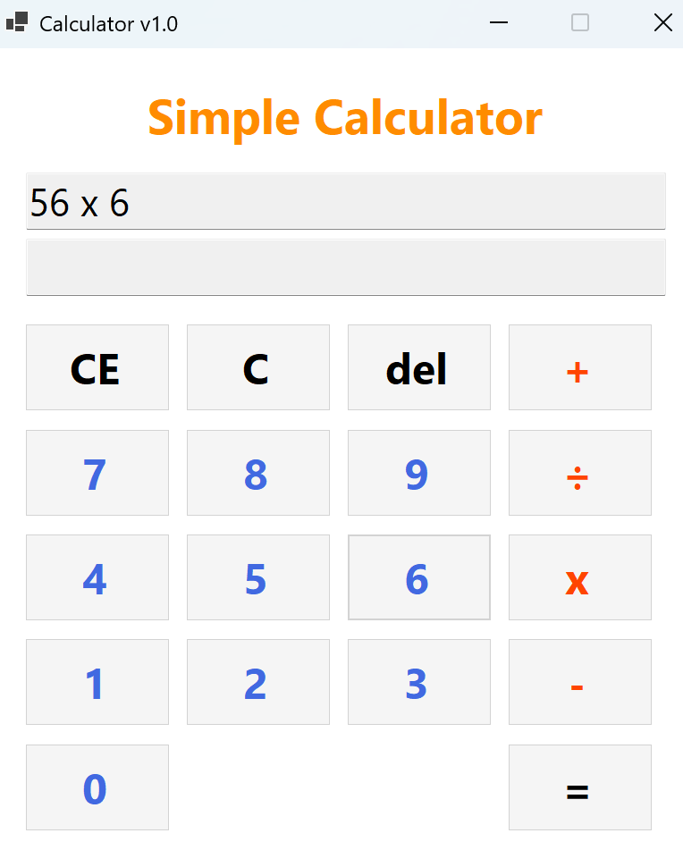

# (C# 코딩) 심플 사칙연산기

## 개요
- C# 프로그래밍 학습
- 1줄 소개: 숫자 버튼과 키보드 입력을 통해 사칙연산(+, -, ×, ÷)을 수행하고, 두 개의 TextBox로 입력 식과 결과를 동시에 표시하는 심플 계산기 프로그램이다.
- 사용한 플랫폼:
    - C#, .NET Windows Forms, Visual Studio, GitHub
- 사용한 컨트롤:
    - Label, TextBox, Button
- 사용한 기술과 구현한 기능:
    - Visual Studio를 이용하여 계산기 UI를 디자인하고 버튼을 격자 형태로 배치한다.
    - int.TryParse()를 이용하여 문자열에서 정수로의 형 변환을 안전하게 처리한다.
    - ToString()을 이용하여 계산 결과값을 문자열로 변환하고 화면에 출력한다.
    - KeyPress 및 KeyDown 이벤트를 이용하여 키보드 숫자 키, 연산자 키, Enter, Backspace, Delete 키 입력을 처리한다.
    - List<int>와 List<string>으로 피연산자와 연산자를 각각 저장하여 수식 전체를 관리한다.
    - Evaluate() 메서드에서 곱하기·나누기를 먼저 처리한 뒤 더하기·빼기를 처리하는 2단계 연산자 우선순위 계산을 구현한다.
    - 0으로 나누기 시 DivideByZeroException을 이용하여 예외처리를 수행하고 오류 메시지를 표시한다.
    - 선행 0 입력 방지 로직을 구현하여 "007"과 같은 비정상적인 숫자 입력을 차단한다.
    - isResult 플래그 변수를 이용하여 계산 결과 상태를 관리한다.

## 실행 화면 (과제1)
- 과제1 코드의 실행 스크린샷

- 과제 내용
    - 숫자 버튼(0~9), 더하기(+), 등호(=) 버튼과 TextBox 2개, 타이틀 Label을 배치하여 기본 UI를 구성한다.
    - 위쪽 TextBox(txtExpression)에는 입력 내용 전체가 누적되어 표시된다.
    - 아래쪽 TextBox(txtResult)에는 현재 입력 중인 숫자 또는 계산 결과값만 표시된다.
    - 컨트롤 이름은 헝가리안 표기법에 따라 btn, txt, lbl 접두사를 붙여 명명한다.
- 구현 내용과 기능 설명
    - 숫자 버튼을 클릭하면 txtExpression에 숫자가 누적되어 표시된다.
    - 숫자가 입력될 때마다 txtResult에도 현재 입력 중인 숫자가 실시간으로 반영된다.
    - 더하기(+) 버튼을 누르면 현재까지 입력된 숫자를 firstNumber 변수에 저장하고, txtExpression에 연산자를 함께 표시한다.
    - 등호(=) 버튼을 누르면 두 번째 숫자를 int.TryParse()로 변환한 뒤 덧셈을 수행하고, 결과를 txtResult에 표시한다.

## 실행 화면 (과제2)
- 과제2 코드의 실행 스크린샷

- 과제 내용
    - 과제1의 더하기 기능에 더해 빼기(-), 곱하기(x), 나누기(÷) 버튼을 추가하여 사칙연산을 완성한다.
    - 각 연산자 버튼은 하나의 공통 이벤트 핸들러(BtnOperator_Click)에 연결한다.
    - 클릭된 버튼의 텍스트를 currentOperator 변수에 저장하여 연산자 종류를 구분한다.
    - 나누기 연산의 경우 두 번째 피연산자가 0인지 반드시 검사하여 예외처리를 수행한다.
- 구현 내용과 기능 설명
    - 연산자 버튼 클릭 시 currentOperator에 연산자를 저장하고 firstNumber를 기록한다.
    - 연산자 입력 직후 txtResult에는 firstNumber 값이 표시되어 사용자가 첫 번째 피연산자를 확인할 수 있다.
    - 등호(=) 버튼 클릭 시 switch 문으로 currentOperator를 분기하여 해당 사칙연산을 수행한다.
    - 결과값은 ToString()으로 변환되어 txtResult에 표시되며, txtExpression에는 "5 x 2 = 10" 형태의 전체 식이 표시된다.
    - 나누기 연산에서 두 번째 수가 0이면 오류 메시지를 출력하고 모든 상태를 초기화한다.

## 실행 화면 (과제3)
- 과제3 코드의 실행 스크린샷

- 과제 내용
    - 첫번째 사진(수식 입력), 두번째 사진(Del 기능 구현), 세번째 사진(C 기능 구현)
    - 계산기의 수정 및 삭제 기능을 담당하는 C, CE, Del 버튼을 추가로 구현한다.
    - C 버튼은 모든 입력과 상태 변수를 완전히 초기화하여 처음 상태로 되돌린다.
    - CE 버튼은 마지막으로 입력한 피연산자만 삭제하여 연산자 이전 상태로 되돌린다.
    - Del 버튼은 마지막으로 입력된 숫자 한 글자만 삭제한다.
    - 각 버튼은 키보드의 Delete, Backspace 키와도 연결되어 키보드만으로도 조작이 가능하다.
- 구현 내용과 기능 설명
    - C 버튼 클릭 시 txtExpression과 txtResult를 비우고, firstNumber, currentOperator, isNewInput, isResult 등 모든 상태 변수를 초기값으로 리셋한다.
    - CE 버튼 클릭 시 연산자가 입력되지 않은 상태이면 전체 식을 지운다.
    - 연산자가 입력된 상태에서 CE를 누르면 두 번째 피연산자만 삭제하여 "firstNumber 연산자" 형태로 되돌리며, txtResult에도 firstNumber가 다시 표시된다.
    - Del 버튼은 Substring()을 이용해 txtExpression의 마지막 글자 하나를 제거한다.
    - Del 버튼 동작 후 UpdateCurrentNumberDisplay()를 호출하여 txtResult도 함께 갱신한다.

## 실행 화면 (과제4)
- 과제4 코드의 실행 스크린샷

- 과제 내용
    - 키보드 숫자 및 연산자 키 입력을 지원한다.
    - 0으로 나누기 예외처리를 구현한다.
    - 연속 계산 기능을 구현하여 등호 없이 연산자를 연속으로 눌러도 자동으로 중간 계산이 수행된다.
    - TextBox 커서 자동 스크롤 및 선행 0 입력 방지 기능을 추가한다.
    - 결과 표시 후 숫자를 누르면 이전 계산을 초기화하고 새 계산을 자동으로 시작한다.
- 구현 내용과 기능 설명
    - KeyPress 이벤트로 숫자(0~9)와 연산자(+, -, *, /) 키보드 입력을 처리하며, *는 곱하기(x), /는 나누기(÷)로 매핑한다.
    - KeyDown 이벤트로 Enter 키는 등호(=), Delete 키는 C, Backspace 키는 Del로 동작하도록 연결한다.
    - 나누기 연산 시 두 번째 숫자가 0이면 "0으로 나눌 수 없습니다" 메시지를 표시하고 상태를 초기화한다.
    - 연속 계산은 isResult 플래그로 구현하며, 결과 상태에서 연산자를 누르면 결과값을 다음 계산의 첫 번째 피연산자로 자동 사용한다.
    - 결과 상태에서 숫자를 누르면 이전 계산을 초기화하고 새 계산을 시작한다.
    - ScrollToEnd()를 통해 텍스트가 길어져도 커서가 항상 끝을 따라가도록 한다.
    - HasLeadingZero()로 현재 입력 중인 숫자 블록이 "0"이면 추가 숫자 입력을 차단하여 선행 0 입력을 방지한다.
    - 수학적 연산자 우선순위(×, ÷ 먼저, +, - 나중)를 적용하여 "3 + 4 x 2 - 1 = 10"과 같은 복합 수식을 한 번에 계산할 수 있도록 구현한다.
    - List<int> numbers와 List<string> operators로 피연산자와 연산자를 각각 저장하고, Evaluate() 메서드에서 2단계 우선순위 계산을 수행한다.
    - Evaluate() 1단계에서 "x"와 "÷"를 먼저 처리하고, 2단계에서 "+"와 "-"를 순서대로 처리하여 최종 결과를 반환한다.
    - BuildExpression() 메서드가 numbers·operators 리스트와 currentInput을 조합하여 txtExpression에 수식을 실시간으로 표시한다.
