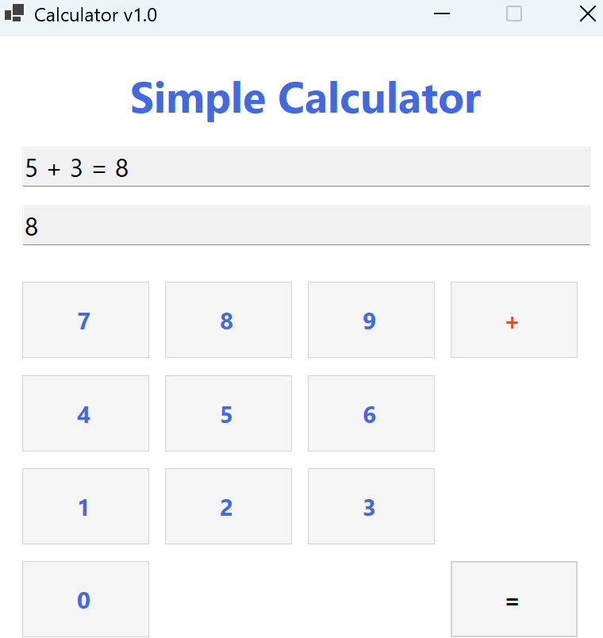
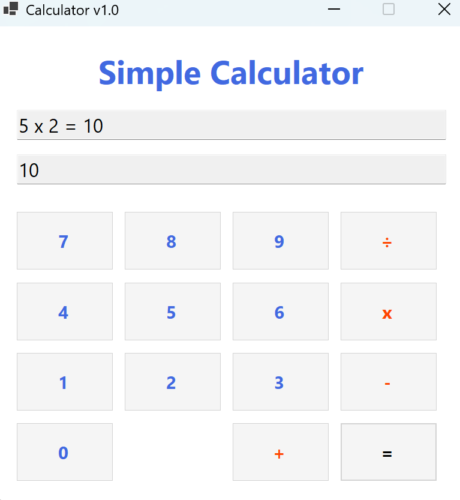
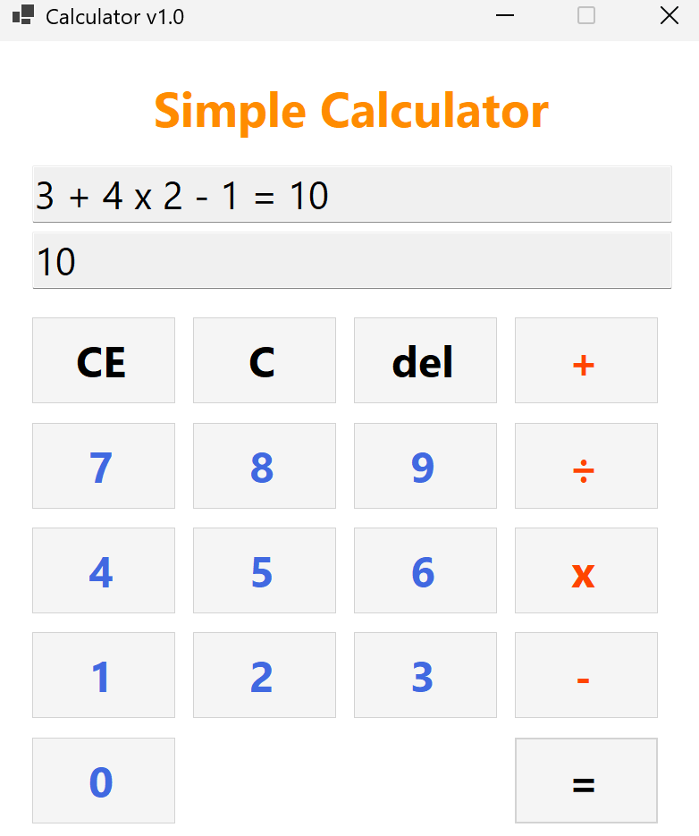

# (C# 코딩) SimpleCalculator

## 개요
- C# 프로그래밍 학습
- 1줄 소개: 사칙연산(+,-,×,÷)과 수정 기능을 갖춘 C# WinForms 계산기 앱
- 사용한 플랫폼:
	- C#, .NET Windows Forms, Visual Studio, GitHub
- 사용한 컨트롤:
	- Label (화면 상단에 "Simple Calculator" 타이틀 텍스트를 표시하는 용도), TextBox 2개 (위쪽은 "5 × 2 = 10"처럼 전체 수식 과정을 표시하고, 아래쪽은 현재 입력 중인 피연산자 또는 최종 계산 결과값을 표시하는 용도), Button 총 20개 (숫자 0~9 버튼 10개, 사칙연산자 +, -, ×, ÷ 버튼 4개, 기능 버튼 CE, C, Del, =, +/-, 소수점 . 버튼 6개)
- 사용한 기술과 구현한 기능:
	- Visual Studio의 Windows Forms 디자이너를 이용하여 계산기 UI를 디자인하고, 숫자 버튼과 연산자 버튼, 기능 버튼들을 격자 형태로 정렬하여 Windows 기본 계산기와 유사한 레이아웃으로 배치하였음
	- string 클래스와 int.Parse() 메서드를 이용하여 TextBox에 입력된 문자열 데이터를 정수형으로 변환한 뒤 사칙연산을 수행하고, 계산 결과를 다시 ToString() 메서드로 문자열 변환하여 TextBox에 출력하는 데이터 타입 변환 기술을 활용함
	- 각 버튼의 Click 이벤트에 이벤트 핸들러를 연결하여 숫자 입력, 연산자 선택, 결과 계산, CE/C/Del 삭제 기능, +/- 부호 반전, 소수점 입력 등 계산기의 모든 동작을 이벤트 기반으로 구현함
	- 연산자 상태를 별도의 변수로 관리하고 switch문 또는 if-else문으로 분기하여, 하나의 등호 버튼 핸들러에서 덧셈·뺄셈·곱셈·나눗셈을 모두 처리할 수 있는 효율적인 구조를 설계함

## 실행 화면 (과제1)
- 과제1 코드의 실행 스크린샷

- 과제 내용
	- TextBox 2개(위쪽은 전체 수식 표시용, 아래쪽은 현재 입력값 및 결과 표시용)와 숫자 Button(0~9), 더하기(+) 버튼, 등호(=) 버튼 등 기본 컨트롤들을 Windows 계산기와 유사한 형태로 적절히 배치합니다.
	- 숫자 버튼 클릭 시 아래쪽 TextBox에 해당 숫자가 이어 붙여져 표시되며, 여러 자리 숫자도 연속으로 입력할 수 있도록 구현합니다. 더하기 연산자와 등호 버튼을 이용하여 두 피연산자의 덧셈 결과를 계산하고 출력합니다.
- 구현 내용과 기능 설명
	- 숫자 버튼(0~9)을 클릭하면 아래쪽 TextBox에 현재 입력 중인 숫자가 한 자리씩 이어 붙여져 표시되고, 위쪽 TextBox에는 지금까지의 전체 입력 과정이 수식 형태로 그대로 표시되어 사용자가 어떤 숫자를 입력했는지 확인할 수 있다.
	- 더하기(+) 버튼을 누르면 현재까지 입력된 숫자가 int.Parse()를 통해 첫 번째 피연산자 변수에 정수값으로 저장되고, 아래쪽 TextBox가 비워져서 두 번째 피연산자 숫자를 새로 입력할 수 있는 상태로 전환된다.
	- 등호(=) 버튼을 누르면 두 번째 피연산자도 int로 변환되어 첫 번째 피연산자와 더하기 연산이 수행되고, 그 결과가 ToString()으로 변환되어 아래쪽 TextBox에 출력되며, 위쪽 TextBox에는 "5 + 3 = 8"과 같은 전체 수식이 표시된다.

## 실행 화면 (과제2)
- 과제2 코드의 실행 스크린샷

- 과제 내용
	- 과제1에서 구현한 더하기(+) 기능을 확장하여 뺄셈(-), 곱셈(×), 나눗셈(÷) 연산자 버튼 3개를 추가로 배치하고, 각 연산자 버튼 클릭 시 연산자 종류만 변경하여 동일한 입력/계산/출력 로직을 적용합니다.
	- 나눗셈의 경우 0으로 나누는 예외 상황이 발생할 수 있으므로, 두 번째 피연산자가 0일 때 오류 메시지를 표시하거나 예외 처리를 하여 프로그램이 비정상 종료되지 않도록 안전하게 구현합니다.
- 구현 내용과 기능 설명
	- 사칙연산 버튼(+, -, ×, ÷) 중 하나를 클릭하면 해당 연산자 기호가 문자열 변수에 저장되고, 등호 버튼을 누를 때 저장된 연산자에 따라 switch문 또는 if-else문으로 분기하여 덧셈·뺄셈·곱셈·나눗셈 중 해당하는 연산을 수행하고 결과를 출력한다.
	- 위쪽 TextBox에는 "12 - 5 = 7"이나 "5 × 2 = 10"처럼 어떤 연산자가 사용되었는지 전체 수식이 명확하게 표시되어 사용자가 어떤 계산을 수행했는지 한눈에 확인할 수 있도록 구현하였다.
	- 연산자 버튼들은 빨간색 등 숫자 버튼과 구별되는 색상으로 표시하여 시각적으로 쉽게 구분할 수 있도록 UI를 구성하였으며, 모든 사칙연산이 동일한 흐름(숫자 입력 → 연산자 선택 → 숫자 입력 → 등호)으로 동작하도록 통일된 로직을 적용하였다.

## 실행 화면 (과제3)
- 과제3 코드의 실행 스크린샷

- 과제 내용
	- 계산기의 수정 및 삭제 기능인 C, CE, Del 버튼 3개를 추가로 배치하고, 각각의 삭제 범위가 서로 다르게 동작하도록 구현합니다. C 버튼은 모든 입력과 연산 상태를 초기화하고, CE 버튼은 현재 입력 중인 피연산자 전체를 삭제하며, Del 버튼은 마지막 한 글자만 삭제합니다.
	- 예를 들어 "12 + 100"을 입력한 상태에서 CE를 누르면 100이 통째로 지워지고 연산자와 첫 번째 피연산자는 유지되며, Del을 누르면 마지막 숫자 '0' 하나만 제거되어 10으로 변경되는 것처럼, 각 버튼의 삭제 동작이 명확히 구분되도록 구현합니다.
- 구현 내용과 기능 설명
	- C 버튼을 클릭하면 저장된 첫 번째 피연산자 변수, 연산자 변수, 위쪽과 아래쪽 두 TextBox의 내용이 모두 초기값("0" 또는 빈 문자열)으로 리셋되어, 마치 계산기를 처음 켠 것처럼 완전히 초기화된 상태로 돌아간다.
	- CE 버튼을 클릭하면 현재 아래쪽 TextBox에 표시된 피연산자 값만 통째로 "0"으로 초기화되며, 이전에 입력하여 저장해둔 첫 번째 피연산자와 연산자 정보는 그대로 유지되므로, 두 번째 숫자만 다시 입력하면 계산을 이어서 진행할 수 있다.
	- Del 버튼을 클릭하면 아래쪽 TextBox에 표시된 문자열의 마지막 한 글자가 Substring 메서드를 이용하여 제거되고, 만약 모든 글자가 지워져서 빈 문자열이 되면 자동으로 "0"이 표시되도록 처리하여 빈 칸 상태가 되지 않게 하였다.

## 실행 화면 (과제4)
- 과제4 코드의 실행 스크린샷

- 과제 내용
	- Windows 운영체제에 내장된 기본 계산기 앱을 직접 사용해보고 분석하여, 동일한 수준의 사용자 편의기능과 특수기능을 내 프로그램에 추가로 구현합니다. +/- 부호 반전, 소수점(.) 입력, 퍼센트(%), 제곱(x²), 제곱근(√x), 역수(1/x) 등의 기능을 추가합니다.
	- 키보드 입력 지원, 연속 계산 기능, 계산 결과를 이어서 사용하는 기능 등 친구들이 "우와~"하고 놀랄 만한 멋진 기능을 자유롭게 구상하고 구현하여, 단순한 사칙연산기를 넘어서는 완성도 높은 계산기 프로그램을 만들어 봅니다.
- 구현 내용과 기능 설명
	- +/- 버튼을 누르면 현재 아래쪽 TextBox에 입력된 숫자의 부호가 양수에서 음수로, 음수에서 양수로 즉시 반전되어 표시되며, 소수점 버튼을 누르면 현재 숫자에 소수점이 추가되고 이미 소수점이 포함된 경우에는 중복 입력이 자동으로 방지되도록 처리하였다.
	- 등호(=) 버튼을 눌러 계산 결과가 표시된 직후에 바로 숫자를 입력하면 새로운 계산이 시작되고, 연산자 버튼을 입력하면 이전 계산 결과값을 첫 번째 피연산자로 자동 사용하여 연속 계산이 가능하도록 구현하여, Windows 기본 계산기와 동일한 연속 계산 흐름을 지원한다.
	- 키보드의 숫자 키(0~9), Enter 키(등호 역할), Backspace 키(Del 역할), Escape 키(C 역할) 등으로도 계산기를 조작할 수 있도록 Form의 KeyDown 이벤트에 핸들러를 연결하여, 마우스 없이 키보드만으로도 모든 기능을 사용할 수 있는 키보드 입력을 지원하였다.

## 배운 내용
- Windows Forms 디자이너를 이용하여 버튼과 텍스트박스를 격자 형태로 정렬 배치하는 UI 설계 방법을 익혔고, 각 컨트롤의 Name 속성을 btnAdd, txtResult처럼 의미 있는 이름으로 지정하는 것이 코드의 가독성과 유지보수성에 매우 중요하다는 점을 깨달았다.
- string과 int 사이의 형변환(int.Parse(), ToString())을 활용하여 사용자 입력 데이터를 처리하는 방법을 익혔고, 이벤트 핸들러를 각 버튼에 연결하여 사용자의 클릭 동작에 반응하는 이벤트 기반 프로그래밍 구조를 이해하고 직접 구현해 볼 수 있었다.
- Git과 GitHub를 활용하여 과제 단계별로 의미 있는 커밋 메시지와 함께 커밋과 푸시를 수행하는 버전 관리 워크플로우를 직접 경험하였으며, 코드 변경 이력을 체계적으로 관리하고 커밋 메시지를 명확하게 작성하는 습관이 협업과 코드 관리에 중요하다는 것을 배웠다.
- CE, C, Del 등 각기 다른 범위의 삭제 기능을 구현하면서 Substring 등 문자열 조작 기법과 프로그램 상태 관리의 중요성을 체감했고, Windows 기본 계산기의 세부 동작을 하나씩 분석하여 동일하게 재현하는 과정에서 요구사항 분석 능력과 로직 설계 능력이 크게 향상되었다.